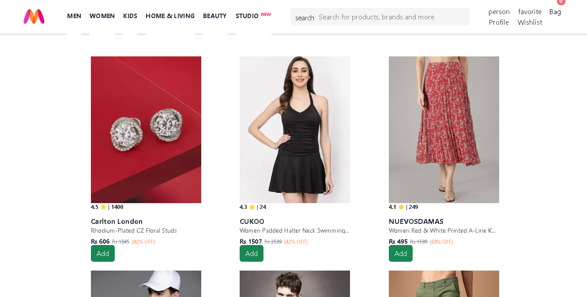
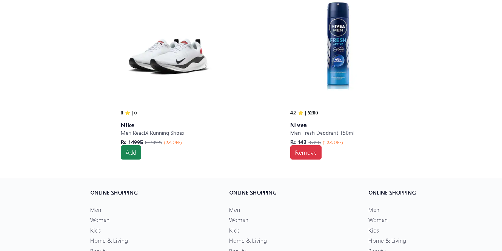
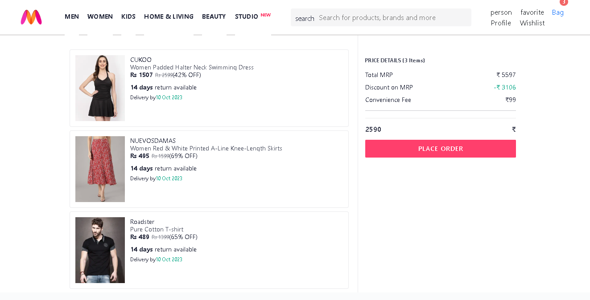

# Full Stack Project Myntra Website Clone

A Simple Basic  Myntra Webpage   Built with  React.js
and Tailwindcss and Bootstrap , Redux Toolkit , Node.js Express.js and  its Providing You Real Feal of Full Stack Project Experience .

## Learning Things in This Project

- This project is provideing you a whole idea of state mangement using Redux toolkit in a proper way

- And That Project is also Provide You a Whole Idea of backend devlopment

- Mainly this project target is to focus on redux toolkit concept on state mangement like : payload, reducer, action, state,  createslice, updateslice, selector , store

- And you can learn about the backend api devlopment

## Screenshots

##

##

## Getting Started

 Follow these instructions to get a copy of the project up and running on your local machine.

### Prerequisites

 - Node.js
 - React.js
 - Redux Toolkit
 - Express.js

 - All These Application Must Be Installed in your System Before Starting The React App

 ### Installing
 1. Clone the repository:

 git clone https://github.com/ssdevloper/FullStack_MyntraClone.git

### Backend Server  Run Command

cd myntraBackend

npm install : (install all the dependencies packege)

npm run start : (Start The  Backend Server) 

### React Frontend  Run Command

cd myntraFrontend

npm install : (install all the dependencies packege)

npm run dev : (Start The  React App) 

### Going on Home Page

- click the myntra logo that will be redirect in your home page 
#### Bag Page
- click the myntra bag that will be redirect in your bag page 
 

### Author

Shubham Singh